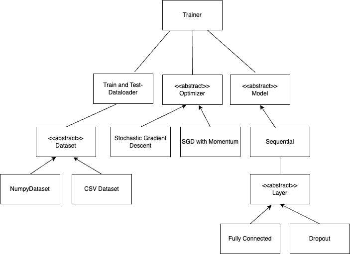

# Neural Network Framework

> A simple neural network framework for educational purposes.


## Table of contents

- [Neural Network Framework](#neural-network-framework)
  - [Table of contents](#table-of-contents)
  - [Project description](#project-description)
- [Features](#features)
- [Class diagram](#class-diagram)
- [Installation](#installation)
- [Usage example (Red wine quality prediction)](#usage-example-red-wine-quality-prediction)
- [Component Explanation](#component-explanation)
    - [Trainer](#trainer)
    - [Dataset](#dataset)
    - [Dataloader](#dataloader)
    - [Optimizer](#optimizer)
    - [Functions](#functions)
    - [Metrics](#metrics)
    - [Transforms](#transforms)
    - [PCA](#pca)
    - [Layers](#layers)
    - [Model](#model)


## Project description

This library was a student project for learning and implementing the math behind deep learning. It includes code for training a fully connected neural network, which can be trained on arbitrary datasets. The library is written in a modular way, so that it can be easily extended with new components.

## Features

- [x] Fully connected layers
- [x] Dropout layers
- [x] Multiple Loss and Activation functions
- [x] Optimizers (SGD, Momentum)
- [x] PCA
- [x] Evaluation metrics (Accuracy, Precision, Recall, F1, confusion matrix)
- [x] Callback functions for validation score
- [x] ...

## Class diagram



## Installation

As a project:

```bash
pip install -r requirements.txt
```

You can also install it as a package:

```bash
pip install git+https://github.com/strasserpatrick/neural_network_framework.git
```

## Usage example (Red wine quality prediction)

```bash
python examples/winequality-binary-classification.py
```

## Component Explanation

### Trainer

Helper class that performs training and evaluation on a model, a dataset and an optimizer. Additionally, it is able to perform sanity checks on the model. Models hyperparameters like learning rate and epochs are set here.

### Dataset

Abstraction for wrapping arbitrary data formats into our dataset class for common handling. `NumpyDataset` is a concrete implementation for numpy arrays. There is also a `CSVDataset` for pandas dataframes.

### Dataloader

Wrapper for dataset, which handles indexing, shuffling, and other data loading related tasks.

### Optimizer

Collection of different optimizers for the backpropagation algorithm. Currently we only implemented SGD and SGD with Momentum. Again, an abstraction is used to make it easy to extend the library with new optimizers.

### Functions

A collection of activation and loss functions, such as Sigmoid, ReLU, Softmax, MSE, CrossEntropy, etc.

### Metrics 

A collection of evaluation metrics for the model. This includes all commonly used metrics, such as Accuracy, Precision, Recall, F1, Confusion Matrix, etc.

### Transforms

A collection of data transforms, such as OneHotEncoding, Minority Sampling, MinMaxScaler, Standardizer, etc.

### PCA

A class for performing PCA on the dataset. This is used for dimensionality reduction. The number of components can be set as a hyperparameter. Also, the explained variance ratio can be plotted.

### Layers

An abstraction for layers in the neural network used for models. Concrete implementations for fully-connected layers and dropout layers are provided.

### Model

Sequential model holds a sequence of layers. The output of the previous layer is the input of the next layer. The model can be trained and evaluated on the dataset. Additionally, it is possible to perform sanity checks on the model, such as gradient checking and overfitting checks.
